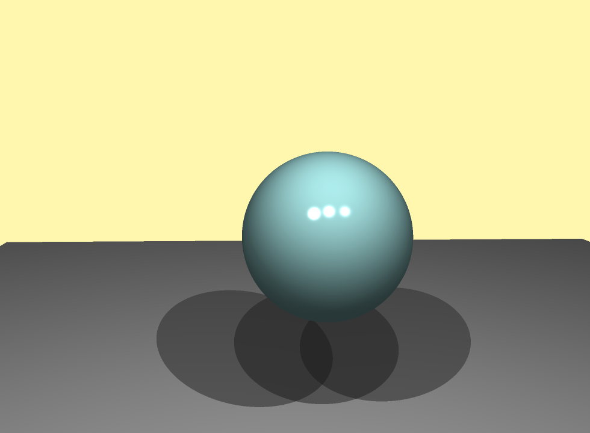
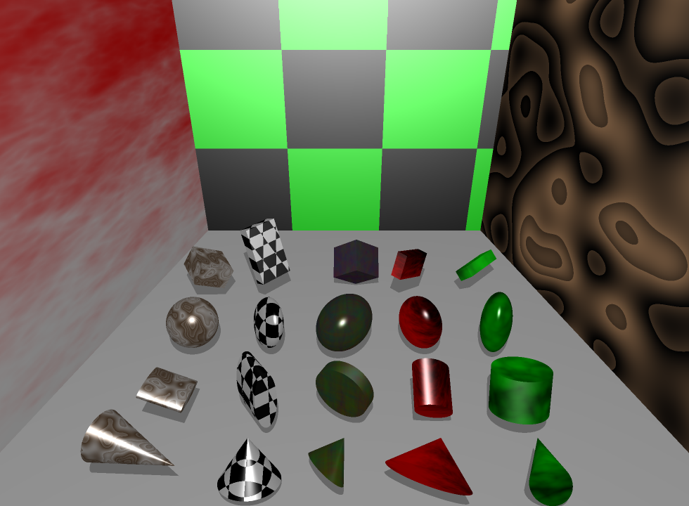
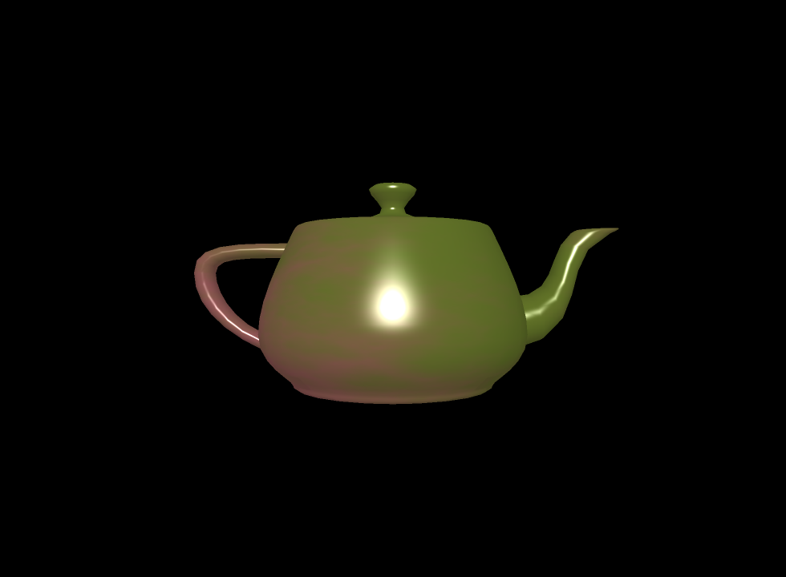

# RT - 42 (UNIT)
This is a team graphic project in school 42 (UNIT), where I took an active part. The aim of the project is to create ray tracer.

### Subject: [rt.en.pdf][1]

### Requirements
- linux or macos
- installed minilibx
- libx11-dev and libxext-dev for linux
- framework OpenGL and framework AppKit for mac

### How does it work?
	make
	./RT [resolution: hd or fhd]

[1]: https://github.com/vtiterin/RT---Final-Project/blob/master/rt.en.pdf
